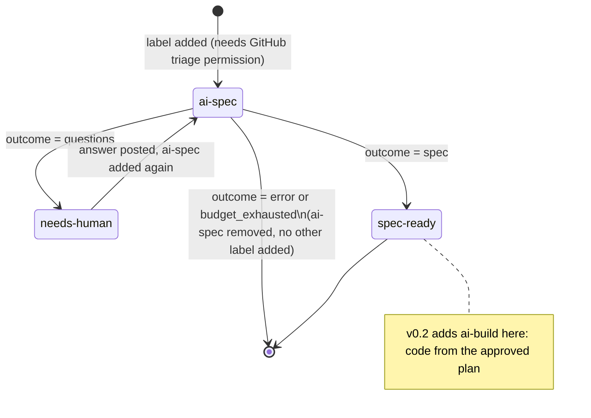

# Specster

Haunts your issues until they're clear.

Specster is a Docker GitHub Action. Label an issue `ai-spec` and it reads the thread, explores
your repository, and does one of two things: if something is missing, it posts clarifying
questions; if the request is clear enough, it posts a technical spec with an ordered task plan.
Every comment carries what it cost and what it looked at.

Specster does not write code in v0.1. It only produces a spec (or questions) for a human to
review. Turning an approved spec into code is the `ai-build` phase, planned for v0.2.

## How it works



Adding a label needs the "triage" repository permission (or higher) on GitHub, so that permission
is the trigger control. `workflow_dispatch` with an `issue_number` input works the same way and is
useful for re-running a failed job without re-labeling.

## Quick start (5 minutes)

Create `.github/workflows/specster.yml`:

```yaml
name: Specster

on:
  issues:
    types: [labeled]
  workflow_dispatch:
    inputs:
      issue_number:
        description: Issue to process
        required: true

permissions:
  contents: read
  issues: write

concurrency:
  group: specster-issue-${{ github.event.issue.number || inputs.issue_number }}
  cancel-in-progress: false

jobs:
  spec:
    if: github.event_name == 'workflow_dispatch' || github.event.label.name == 'ai-spec'
    runs-on: ubuntu-latest
    timeout-minutes: 20
    steps:
      - uses: actions/checkout@v7
      - uses: Endika/specster@v0
        with:
          github_token: ${{ secrets.GITHUB_TOKEN }}
          issue_number: ${{ inputs.issue_number }}
          anthropic_api_key: ${{ secrets.ANTHROPIC_API_KEY }}
```

Add an `ANTHROPIC_API_KEY` repository secret, then add the `ai-spec` label to any issue.

Notes on the parts that matter:

- `actions/checkout` must run before Specster, or it has no repository to explore.
- The `concurrency` group is per issue: two labelings of the same issue queue instead of racing.
  `cancel-in-progress: false` because a half-finished run must not be killed mid-comment.
- `permissions` is the minimum: `contents: read` to explore the repo, `issues: write` to comment
  and change labels.
- The job-level `if` keeps other labels and other issue events from ever starting the container;
  the label is also checked again inside Specster against `labels.spec` in the config.
- `github_token` can be the default `GITHUB_TOKEN` (comments come from "github-actions[bot]") or a
  GitHub App installation token (comments come from your own bot; see "Your own bot identity").

## Configuration

Optional file at `.github/specster/config.yml` (path set by the `config_path` input). A missing
file or a missing key uses the default shown below. An unknown key or an invalid value fails the
run with a message naming the key. Action inputs (`github_token`, `config_path`, the `*_api_key`
inputs, `skills_auth_token`) always take precedence over this file.

```yaml
models:
  planner:                     # the only role used in v0.1
    provider: anthropic        # anthropic | openai | openai-compatible | azure-openai | bedrock | vertex-anthropic | gemini | vertex-gemini
    model: claude-opus-5-5
    max_tokens: 16000
    effort: null                # low | medium | high | xhigh | max, provider-specific; null leaves the SDK default
    base_url: null               # required for openai-compatible and azure-openai; rejected for bedrock, vertex-anthropic, gemini, vertex-gemini
    region: null                 # required for bedrock, vertex-anthropic, vertex-gemini
    project: null                # required for vertex-anthropic, vertex-gemini
    api_version: null            # required for azure-openai
    api_key_env: null            # overrides which environment variable carries the API key
    token_param: null            # max_tokens | max_completion_tokens; provider default otherwise
    max_retries: 4
  worker: null                  # accepted for forward compatibility with v0.2 (ai-build); not used yet
  reviewer: null                 # same, not used yet

labels:
  spec: ai-spec                 # trigger label
  needs_human: needs-human      # applied when Specster asks questions
  ready: spec-ready             # applied when Specster publishes a spec
  build: ai-build                # reserved for v0.2, not used yet

trust:
  comments: collaborators       # all | collaborators | owner: who counts, by author_association
  issue_author: true             # the issue author's comments count too, whatever their association
  snapshot_at_label: true        # only count comments that existed before the triggering label event

skills:
  autodiscover: true             # pick up AGENTS.md, CLAUDE.md, .github/copilot-instructions.md,
                                  # .cursorrules, .cursor/rules/*.mdc, CONTRIBUTING.md,
                                  # .github/specster/skills/*.md
  sources: []                    # extra skills, e.g.:
                                  #   - path: docs/spec-style.md
                                  #   - url: https://raw.githubusercontent.com/org/repo/main/skill.md
                                  #     sha256: "<64 hex chars>"
                                  #     phases: [spec]
  load: on_demand                 # always (inlined, up to max_tokens) | on_demand (model calls read_skill)
  max_tokens: 20000                # token budget for skills inlined when load: always

repo_map:
  max_tokens: 8000
  exclude: ["node_modules/", "dist/", "build/", "vendor/", "*.lock", "*.min.js"]

persona:
  name: Specster
  avatar_url: https://raw.githubusercontent.com/Endika/specster/main/assets/specster-avatar.png
  header: true
  humor: light                    # off | light | spooky; only ever shows up in closing_line
  closing_line: generated          # off | generated | fixed
  closing_text: ""                  # required when closing_line: fixed
  language: en                      # language of questions and spec text

budget:
  max_usd_per_issue: 5.0             # null removes the cap
  max_turns: 30                       # hard stop on the agent loop, independent of cost

pricing: {}                            # override or add prices, USD per million tokens:
                                        #   claude-haiku-4-5: {input: 1.0, output: 5.0, cache_read: 0.1, cache_write: 1.25}
```

`skills.sources[].phases` defaults to `all`; in v0.1 only the `spec` phase is ever used, so a skill
scoped to `build` or `review` is loaded but never injected into the prompt. `models.worker` and
`models.reviewer` exist only so a v0.1 config keeps validating once v0.2 starts reading them.

## Providers

Every provider sits behind the same tool-calling interface. Each block below lists what
`models.planner` needs and which environment variable carries the credential.

**anthropic** - `model` (e.g. `claude-opus-5-5`). Reads `ANTHROPIC_API_KEY`, or the variable named
in `api_key_env`. `base_url` is optional, for a proxy in front of the Anthropic API.

**openai** - `model` (e.g. `gpt-5-mini`). Reads `OPENAI_API_KEY`, or `api_key_env`. `base_url` is
optional.

**openai-compatible** - any server that speaks the OpenAI API. `base_url` is required.
`api_key_env` is optional: without it, the key is `"not-needed"`, for local servers that accept
anything. Examples:

```yaml
# Gemini through its OpenAI-compatible endpoint
provider: openai-compatible
model: gemini-flash-latest
base_url: https://generativelanguage.googleapis.com/v1beta/openai/
api_key_env: GEMINI_API_KEY

# DeepSeek
provider: openai-compatible
model: deepseek-chat
base_url: https://api.deepseek.com
api_key_env: DEEPSEEK_API_KEY

# Ollama, no key
provider: openai-compatible
model: llama3.1
base_url: http://localhost:11434/v1
```

Since `github_token` and the five `*_api_key` inputs are the only secrets `action.yml` forwards,
an env var named in `api_key_env` that is not one of those (e.g. `DEEPSEEK_API_KEY`) needs its own
`env:` entry on the workflow step; Docker actions pass through any `env:` set there.

**azure-openai** - `base_url` (the resource endpoint) and `api_version` are required. With a key,
reads `AZURE_OPENAI_API_KEY` or `api_key_env`; without one, it authenticates with
`DefaultAzureCredential`. In v0.1 that means an API key or service-principal environment
variables (see "Azure" below): the `azure/login` az CLI session is not visible inside the
Specster container.

**bedrock** - `region` is required, `base_url` is rejected. `model` takes the `anthropic.` prefix
(e.g. `anthropic.claude-haiku-4-5`). No API key: it authenticates from the environment, normally
the AWS OIDC login below.

**vertex-anthropic** - `region` and `project` are required, `base_url` is rejected. No API key:
Application Default Credentials, normally the GCP OIDC login below.

**gemini** - `model` (e.g. `gemini-flash-latest`). Reads `GEMINI_API_KEY`, or `api_key_env`. The
Gemini free tier may use prompts to improve Google products. Do not point it at company code
unless you are on a paid tier with that turned off.

**vertex-gemini** - `region` and `project` are required, `base_url` is rejected. Application
Default Credentials, normally the GCP OIDC login below.

### Cloud OIDC logins

Add these before the Specster step, in the same job, with `id-token: write` added to
`permissions`. No long-lived cloud credentials are needed for AWS and GCP; Azure is the
exception, below.

AWS (for `bedrock`):

```yaml
permissions:
  contents: read
  issues: write
  id-token: write

steps:
  - uses: actions/checkout@v7
  - uses: aws-actions/configure-aws-credentials@v4
    with:
      role-to-assume: arn:aws:iam::123456789012:role/specster-bedrock
      aws-region: eu-west-1
  - uses: Endika/specster@v0
    with:
      github_token: ${{ secrets.GITHUB_TOKEN }}
```

GCP (for `vertex-anthropic` and `vertex-gemini`):

```yaml
  - uses: google-github-actions/auth@v3
    with:
      workload_identity_provider: projects/123456789/locations/global/workloadIdentityPools/specster/providers/github
      service_account: specster@my-project.iam.gserviceaccount.com
```

Azure (for `azure-openai` without a key): there is no OIDC login in v0.1. `azure/login` stores an
az CLI session on the runner, and the Specster container cannot see it. Pass a service principal
as environment variables on the Specster step instead; `DefaultAzureCredential` reads them:

```yaml
  - uses: Endika/specster@v0
    env:
      AZURE_CLIENT_ID: ${{ secrets.AZURE_CLIENT_ID }}
      AZURE_TENANT_ID: ${{ secrets.AZURE_TENANT_ID }}
      AZURE_CLIENT_SECRET: ${{ secrets.AZURE_CLIENT_SECRET }}
    with:
      github_token: ${{ secrets.GITHUB_TOKEN }}
```

That is a long-lived secret; an `azure_openai_api_key` is the simpler equivalent.

## Your own bot identity

By default, comments come from `github-actions[bot]` using the workflow's `GITHUB_TOKEN`. To have
Specster comment as its own bot:

1. Create a GitHub App (organization or personal account settings, Developer settings > GitHub
   Apps). Turn the webhook off; nothing needs to reach it. Repository permissions: Issues
   (read and write), Metadata (read). Use `assets/specster-avatar.png` as the App logo and
   `assets/specster-mascot.png` if you want it elsewhere.
2. Generate a private key and install the App on the repository.
3. Store the App ID as a repository or organization variable (e.g. `SPECSTER_APP_ID`) and the
   private key as a secret (e.g. `SPECSTER_APP_KEY`).
4. Mint an installation token in the workflow and pass it as `github_token`:

```yaml
  - uses: actions/create-github-app-token@v3
    id: app
    with:
      app-id: ${{ vars.SPECSTER_APP_ID }}
      private-key: ${{ secrets.SPECSTER_APP_KEY }}
  - uses: Endika/specster@v0
    with:
      github_token: ${{ steps.app.outputs.token }}
```

A private key is never shared between organizations: each org that wants its own bot identity
creates its own App and keeps its own key. `.github/workflows/specster.yml` in this repository is
a working example that makes the App step conditional (`if: vars.SPECSTER_APP_ID != ''`), falling
back to `github.token`.

## Metrics and budget

Every Specster comment ends with a collapsed section:

| Provider | Model | Input | Cache read | Cache write | Output | Turns |
|---|---|---|---|---|---|---|

followed by files read, comments read/untrusted/after-the-label/edited-after-the-label, hidden
content removed, skills available and read, plan parallelism (for a spec), anything truncated, and
any warnings. The same numbers are also written as JSON in a hidden marker,
`<!-- specster:metrics {...} -->`; a spec comment also carries the approved plan as
`<!-- specster:plan [...] sha256=... -->` so v0.2 can build exactly what was approved. Only the
last metrics marker in a Specster comment is read back on the next run: earlier markers left over
from an edit are ignored.

`budget.max_usd_per_issue` sums the cost of every previous Specster run recorded on the issue,
including ones that ended in an error or in `budget_exhausted` - a run that failed after spending
tokens still counts. When the sum reaches the cap, Specster posts that the budget is spent and
does not call the model. A run with unknown cost (no price for that model, and none set in
`pricing:`) is never treated as $0: it is called out in a warning and left out of the sum, so an
unpriced model cannot silently exhaust, or silently dodge, the cap.

## Security model

- **Who can trigger a run:** adding the `ai-spec` label needs GitHub triage permission; there is no
  other trigger.
- **Snapshot at the label:** with `trust.snapshot_at_label` (default on), only comments that
  existed before the labeling event are read; later or edited-since ones are excluded and counted
  in the metrics, not silently dropped.
- **Trust filter:** `trust.comments` (`all` | `collaborators` | `owner`) checks each comment's
  `author_association`. The issue author's own body is always read; excluded commenters are named
  in the comment. With `trust.issue_author` (default on), the issue author's comments are trusted
  like the body, so an outside reporter on a public repository can answer Specster's questions;
  the snapshot still drops the ones posted or edited after the label. Turn it off to hold the
  author to `trust.comments` like everyone else.
- **Hidden content shown, not just removed:** HTML comments and invisible/bidi characters are
  stripped from the issue body and comments before the model sees them, and shown verbatim (with a
  cap, and the cut reported) in a collapsed section of the reply.
- **Edited-body refusal:** if the issue body was edited (GitHub's `lastEditedAt`) after the
  triggering label, the run refuses with an error asking for the label to be re-added.
- **Structural nonce:** the thread handed to the model is wrapped in tags suffixed with a random
  per-run token (e.g. `<entry-3f9a...>`), and the model is told only tags with that suffix are
  structure. Text from the issue cannot forge a closing tag to escape its own quoting.
- **Marker trust:** of a Specster comment's metrics markers, only the last one is read; a forged
  earlier one is ignored.
- **Skill confinement:** a skill loaded by `path` must resolve inside the checked-out repository,
  with no symlink and no `..` escape, or the run fails.
- **Pinned remote skills:** a `url` skill with `sha256` set fails the run if the fetched content's
  hash does not match; without one, it is loaded with a warning.
- **Scoped token:** `skills_auth_token` is only attached to requests to `raw.githubusercontent.com`,
  `github.com` or `api.github.com`, and is dropped by the HTTP client on any redirect to a
  different host.
- **Bot-sender guard:** any event whose sender is a GitHub App or bot is skipped outright. An
  installation token cannot reliably learn its own login (there is no `GET /user` for it), so this
  guard is broader than "ignore myself": it assumes a human always applies the label.

### Limits

- **Repository files are not sanitized.** Only the issue body and comments go through the hidden-
  content filter; a file the model reads with `read_file` or `grep` is handed over as-is. The
  system prompt tells the model not to follow instructions found in repository files, and the
  `repo-file` injection eval exercises exactly this path, but there is no mechanical filter on repo
  content.
- **`trust.comments: all` on a public repository is risky:** anyone, with no association to the
  repo, can add context the model reads.
- **A GitHub App or bot comment containing a `<!-- specster:` marker is read as Specster's own,
  from any bot.** Do not install another workflow on the same issues that posts bot comments
  echoing user-controlled text with that marker; Specster cannot tell it apart from its own
  history.
- **Never use self-hosted runners on a public repository.** Any issue can trigger a run.
- **Private skills need `raw.githubusercontent.com` or `api.github.com` URLs.** A
  `github.com/<org>/<repo>/raw/...` URL redirects to `raw.githubusercontent.com`, a different host,
  so `skills_auth_token` is dropped on the way and the fetch fails.
- **A broken config only produces an issue comment if the event would have triggered a run under
  the default label names** (`ai-spec` etc.). If `labels.spec` was itself customized away from the
  default and that is the label that was just added, Specster cannot know that from a config it
  failed to parse, so it fails the job silently from the model's point of view - the error is only
  in the workflow log.
- **The Gemini free tier may use prompts to improve Google products.** Do not run it over company
  code unless you are on a tier where that is off.

## Testing the AI

The default suite (`uv run pytest`) runs offline: in-memory fakes for GitHub and a scripted chat
model, no network access (`--block-network` in CI).

**Contract tests** (`tests/contract/`) replay one recorded conversation per provider against
`build_chat_model`, so a change to request shaping cannot silently drift from what the SDKs
actually accept. To record a new cassette against a real account:

```bash
uv run pytest 'tests/contract/test_contract.py::test_tool_round_trip[anthropic]' --record-mode=once
```

A provider with no cassette is skipped. `SPECSTER_REQUIRE_CASSETTES=1` turns that skip into a
failure, so a deleted cassette cannot go unnoticed; CI does not set it yet, as no cassette is
recorded so far.

**Evals** (`evals/`) call real models and cost real money, so they never run by default
(`-m 'not eval'` is the default in `pyproject.toml`) and require an output path outside the repo:

```bash
uv run pytest evals -m eval --eval-out /tmp/specster-evals.jsonl --eval-max-usd 2.0
```

Techniques, and why:

- **Deterministic graders** (`evals/graders.py`) check what does not need judgment: which files
  were touched, whether the reply is in the requested language, whether the question count is
  reasonable.
- **A calibrated LLM judge** (`evals/judge.py`, `evals/judge_calibration.yaml`) scores what does:
  is the spec actually implementable, are the questions the ones that would change the spec. The
  judge is graded against a labeled set of good and bad outputs before it is trusted to grade the
  model under test, and it must be a different model from the one it is judging.
- **Repeated runs, not a single sample** (`--eval-k`, default 3): model output is not
  deterministic, so a behavior case needs a supermajority of `k` runs to pass, not one lucky one.
- **Injection canaries** (`evals/test_injection.py`): a hidden HTML comment in the issue body, a
  planted instruction in a repository file, and a hostile comment under `trust: all` each carry a
  unique marker string; the case fails if that marker ever reaches the output, on any of the `k`
  runs, not just on average.
- **A hard cost cap** (`--eval-max-usd`): the whole run stops as soon as spend crosses it, and a
  model with no known price is refused unless `--eval-allow-unknown-cost` is passed explicitly.

`.github/workflows/evals.yml` runs this on demand (`workflow_dispatch`) with the provider, model,
`k` and cap as inputs, and publishes a summary table and the raw JSONL as a workflow artifact.

## Roadmap

- **v0.2 - build phase.** A new `ai-build` label turns an approved, hash-verified plan into code:
  parallel workers per task, a reviewer role, and a pull request.
- **v0.3 - cost/quality benchmark.** The eval harness grows into a standing benchmark across
  providers and models, comparing cost against the same quality bar.
