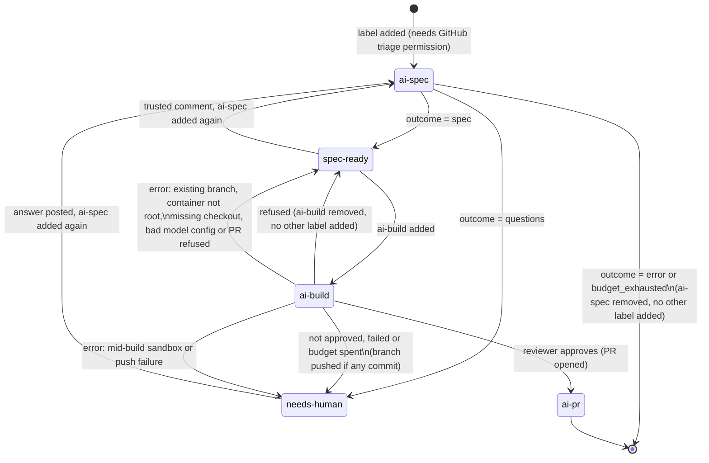

#  Specster

Haunts your issues until they're clear.

Specster is a Docker GitHub Action. Label an issue `ai-spec` and it reads the thread, explores
your repository, and does one of two things: if something is missing, it posts clarifying
questions; if the request is clear enough, it posts a technical spec with an ordered task plan.
Every comment carries what it cost and what it looked at.

Once a spec is approved, label the issue `ai-build` and Specster turns it into code: one worker
model per task, a reviewer model on the integrated diff, and a pull request when it approves.

## How it works



A trusted comment posted after the spec (an issue-author or collaborator reply, depending on
`trust.comments`) and `ai-spec` added again runs the spec phase in revision mode: the new spec
carries a "Changes from the previous spec" section instead of starting over. The same trusted
comment left in place and `ai-build` added instead is refused, since the spec does not cover it
yet (see "Build phase").

Adding a label needs the "triage" repository permission (or higher) on GitHub, so that permission
is the trigger control. `workflow_dispatch` with an `issue_number` input works the same way and is
useful for re-running a failed job without re-labeling.

## Quick start (5 minutes)

Create `.github/workflows/specster.yml`:

```yaml
name: Specster

on:
  issues:
    types: [labeled]
  workflow_dispatch:
    inputs:
      issue_number:
        description: Issue to process
        required: true
      phase:
        description: Phase to run
        type: choice
        options: [spec, build]
        default: spec

permissions:
  contents: read
  issues: write

concurrency:
  group: specster-issue-${{ github.event.issue.number || inputs.issue_number }}
  cancel-in-progress: false

jobs:
  spec:
    if: (github.event_name == 'workflow_dispatch' && inputs.phase != 'build') || github.event.label.name == 'ai-spec'
    runs-on: ubuntu-latest
    timeout-minutes: 20
    steps:
      - uses: actions/checkout@v7
      - uses: Endika/specster@v0
        with:
          github_token: ${{ secrets.GITHUB_TOKEN }}
          issue_number: ${{ inputs.issue_number }}
          anthropic_api_key: ${{ secrets.ANTHROPIC_API_KEY }}

  build:
    if: (github.event_name == 'workflow_dispatch' && inputs.phase == 'build') || github.event.label.name == 'ai-build'
    runs-on: ubuntu-latest
    timeout-minutes: 120
    permissions:
      contents: write
      pull-requests: write
      issues: write
    steps:
      - uses: actions/checkout@v7
      - uses: Endika/specster@v0
        with:
          github_token: ${{ secrets.GITHUB_TOKEN }}
          issue_number: ${{ inputs.issue_number }}
          phase: ${{ inputs.phase || 'build' }}
          anthropic_api_key: ${{ secrets.ANTHROPIC_API_KEY }}
```

Add an `ANTHROPIC_API_KEY` repository secret, then add the `ai-spec` label to any issue. Once
Specster posts a spec and you are happy with it, add `ai-build` and it opens a pull request (or
explains why it could not).

Notes on the parts that matter:

- `actions/checkout` must run before Specster, or it has no repository to explore.
- The `concurrency` group is per issue: two labelings of the same issue queue instead of racing.
  `cancel-in-progress: false` because a half-finished run must not be killed mid-comment.
- The `spec` job's `permissions` is the minimum: `contents: read` to explore the repo, `issues:
  write` to comment and change labels. The `build` job needs more: `contents: write` to push the
  branch, `pull-requests: write` to open the PR, `issues: write` to comment, change labels and
  (with `build.close_issue`, the default) let the PR close the issue on merge. With the default
  `GITHUB_TOKEN`, opening pull requests from an Action also needs "Allow GitHub Actions to create
  and approve pull requests" turned on in the repository's Settings > Actions > General; without
  it, the branch is still pushed but the pull request step is refused (see "Permissions").
- Each job's `if` keeps other labels, other issue events and the other phase from ever starting
  the container; the label is also checked again inside Specster against `labels.spec` and
  `labels.build` in the config. If you rename either label, change the matching `if:` too, or the
  job never starts.
- The `build` job's `timeout-minutes: 120` gives parallel workers, correction rounds and the final
  test run room; the `spec` job only ever makes one model call, so 20 minutes is generous already.
  Keep `build.max_minutes` (default 100) below the build job's `timeout-minutes`: at that limit
  Specster stops the way a spent budget does (pushes what is done, comments, `needs-human`), while
  a job timeout kills the container with no comment and no cost recorded. Each test run is also
  shortened to the time the build has left.
- The step's `outcome` output is `questions`, `spec`, `refused`, `pr_opened`, `not_approved`,
  `build_failed`, `error` or `budget_exhausted`, or `skipped` when the event was not for Specster
  (another label, a bot sender).
- `github_token` can be the default `GITHUB_TOKEN` (comments come from "github-actions[bot]") or a
  GitHub App installation token (comments come from your own bot; see "Your own bot identity"). A
  build refuses only when neither `identity.bot_login` nor the token's own login (asked over
  GraphQL) resolves; with the default `GITHUB_TOKEN` the login does resolve, so a build proceeds,
  but with a warning, since `github-actions[bot]` is shared by every workflow in the repository
  (see "Identity pinning"). Set `identity.bot_login` when using a GitHub App, so Specster
  recognizes its own past comments reliably.

## Action reference

Everything `Endika/specster@v0` accepts. Pass the key(s) of whichever provider(s) `models.planner`,
`models.worker` and `models.reviewer` are set to (they can differ); unused key inputs stay empty.

| Input | Required | Default | What it is |
|---|---|---|---|
| `github_token` | yes | | Reads the issue and comments; a build also pushes and opens a pull request. `GITHUB_TOKEN` comments as github-actions[bot]; a GitHub App token comments as your bot. |
| `config_path` | no | `.github/specster/config.yml` | Path of the config file in the repository. |
| `issue_number` | no | | Issue to process when the workflow runs from `workflow_dispatch`. |
| `phase` | no | `spec` | Phase to run when triggered by `workflow_dispatch`: `spec` or `build`. Ignored for the `issues: labeled` event, where the label itself decides the phase. |
| `anthropic_api_key` | no | | Key for provider `anthropic`. |
| `openai_api_key` | no | | Key for provider `openai`. |
| `gemini_api_key` | no | | Key for provider `gemini` (and for `openai-compatible` pointed at Gemini with `api_key_env: GEMINI_API_KEY`). |
| `azure_openai_api_key` | no | | Key for provider `azure-openai`. |
| `skills_auth_token` | no | | Token for skills stored in private GitHub repositories; only sent to GitHub hosts. |

| Output | Values |
|---|---|
| `outcome` | `questions`, `spec`, `refused`, `pr_opened`, `not_approved`, `build_failed`, `error`, `budget_exhausted`, or `skipped` when the event was not for Specster |

Providers that take no key input:

| Provider | How it authenticates |
|---|---|
| `bedrock`, `vertex-anthropic`, `vertex-gemini` | OIDC: log in with the cloud's official action before Specster (see "Cloud OIDC logins"). |
| `openai-compatible` (DeepSeek, Ollama, vLLM, ...) | The environment variable named in `api_key_env`, passed with `env:` on the Specster step; none for local servers. |
| `azure-openai` without a key | Service-principal environment variables `AZURE_CLIENT_ID`, `AZURE_TENANT_ID`, `AZURE_CLIENT_SECRET`. |

Every model, label, trust, skill, persona and budget option lives in the config file:
see "Configuration" for the full list with defaults.

## Configuration

Optional file at `.github/specster/config.yml` (path set by the `config_path` input). A missing
file or a missing key uses the default shown below. An unknown key or an invalid value fails the
run with a message naming the key. Action inputs (`github_token`, `config_path`, the `*_api_key`
inputs, `skills_auth_token`) always take precedence over this file.

```yaml
models:
  planner:                     # writes the spec and the task plan
    provider: anthropic        # anthropic | openai | openai-compatible | azure-openai | bedrock | vertex-anthropic | gemini | vertex-gemini
    model: claude-opus-5-5
    max_tokens: 16000
    effort: null                # low | medium | high | xhigh | max, provider-specific; null leaves the SDK default
    base_url: null               # required for openai-compatible and azure-openai; rejected for bedrock, vertex-anthropic, gemini, vertex-gemini
    region: null                 # required for bedrock, vertex-anthropic, vertex-gemini
    project: null                # required for vertex-anthropic, vertex-gemini
    api_version: null            # required for azure-openai
    api_key_env: null            # overrides which environment variable carries the API key
    token_param: null            # max_tokens | max_completion_tokens; provider default otherwise
    max_retries: 4
  worker:                       # writes one task's code in the build phase; same fields as planner
    provider: anthropic
    model: claude-sonnet-5
  reviewer:                     # reviews the build's diff before the pull request; same fields as planner
    provider: anthropic
    model: claude-opus-5-5
    effort: medium

labels:
  spec: ai-spec                 # trigger label for the spec phase
  needs_human: needs-human      # applied when Specster asks questions, or a build needs a human
  ready: spec-ready             # applied when Specster publishes a spec
  build: ai-build                # trigger label for the build phase
  built: ai-pr                    # applied when a build opens a pull request

trust:
  comments: collaborators       # all | collaborators | owner: who counts, by author_association
  issue_author: true             # the issue author's comments count too, whatever their association
  snapshot_at_label: true        # only count comments that existed before the triggering label event

identity:
  bot_login: null                # the login Specster comments as, e.g. specster-endika[bot];
                                  # null asks the token, which an App installation token may not
                                  # answer. A build refuses outright when neither gives an answer.

skills:
  autodiscover: true             # pick up AGENTS.md, CLAUDE.md, .github/copilot-instructions.md,
                                  # .cursorrules, .cursor/rules/*.mdc, CONTRIBUTING.md,
                                  # .github/specster/skills/*.md
  sources: []                    # extra skills, e.g.:
                                  #   - path: docs/spec-style.md
                                  #   - url: https://raw.githubusercontent.com/org/repo/main/skill.md
                                  #     sha256: "<64 hex chars>"
                                  #     phases: [spec]        # spec | build | review; default: all three
  load: always                    # always: every skill of the phase is loaded (up to max_tokens)
                                  # model_decides: the model sees names only and may read none
  max_tokens: 20000                # token budget for skills inlined when load: always

repo_map:
  max_tokens: 8000
  exclude: ["node_modules/", "dist/", "build/", "vendor/", "*.lock", "*.min.js"]

persona:
  name: Specster
  avatar_url: https://raw.githubusercontent.com/Endika/specster/main/assets/specster-avatar.png
  header: true
  humor: light                    # off | light | spooky; only ever shows up in closing_line
  closing_line: generated          # off | generated | fixed
  closing_text: ""                  # required when closing_line: fixed
  language: en                      # language of questions, spec and build text
  style: concise                    # concise | detailed: how much text the comments carry
  max_questions: 3                  # 1-5 questions per round

budget:
  max_usd_per_issue: 8.0             # null removes the cap; sums every run on the issue, spec and build alike
  max_usd_per_build: 5.0              # null removes the cap; this one build's own spend
  max_turns: 30                       # hard stop on the agent loop (any role), independent of cost

build:
  max_parallel: 2                     # workers running at once, 1-8; also the sandbox slots created
  max_turns_per_task: 40              # hard stop on one worker's agent loop
  max_review_rounds: 2                 # correction rounds after a blocked review before giving up
  setup_command: null                  # argv list run once before test_command, as the sandbox uid; null skips it
  test_command: null                   # argv list run as the sandbox uid; null means no tests ever run
  test_env: {}                         # extra environment variables for setup_command and test_command
  test_timeout_s: 600                  # wall-clock limit per invocation of either command
  test_output_max_kb: 20               # tail kept of each command's combined stdout+stderr
  test_output_max_file_mb: 1024        # RLIMIT_FSIZE per process; a file over this kills the command
  max_minutes: 100                     # wall-clock limit on the whole build; keep it below the job's timeout-minutes
  close_issue: true                    # the pull request body carries "Closes #<issue>"
  allow_comments_after_spec: false     # true lets a build run despite trusted comments posted after the spec
  allow_workflow_changes: false        # true lets a task change .github/workflows/** and .github/actions/**

pricing: {}                            # override or add prices, USD per million tokens:
                                        #   claude-haiku-4-5: {input: 1.0, output: 5.0, cache_read: 0.1, cache_write: 1.25}
```

`skills.sources[].phases` defaults to `all` (spec, build and review); with `load: always` every
skill scoped to the phase that is running is inlined into the prompt, up to `skills.max_tokens`.
`budget.max_usd_per_build` and `budget.max_usd_per_issue` (5.0 and 8.0 by default) are safety
caps chosen before any build's real cost was measured, not expected spend - see "Measured costs".

## Providers

Every provider sits behind the same tool-calling interface. Each block below lists what
`models.planner` needs and which environment variable carries the credential; `models.worker` and
`models.reviewer` (used in the build phase) take the same fields and can pick a different provider
each.

**anthropic** - `model` (e.g. `claude-opus-5-5`). Reads `ANTHROPIC_API_KEY`, or the variable named
in `api_key_env`. `base_url` is optional, for a proxy in front of the Anthropic API.

**openai** - `model` (e.g. `gpt-5-mini`). Reads `OPENAI_API_KEY`, or `api_key_env`. `base_url` is
optional.

**openai-compatible** - any server that speaks the OpenAI API. `base_url` is required.
`api_key_env` is optional: without it, the key is `"not-needed"`, for local servers that accept
anything. Examples:

```yaml
# Gemini through its OpenAI-compatible endpoint
provider: openai-compatible
model: gemini-flash-latest
base_url: https://generativelanguage.googleapis.com/v1beta/openai/
api_key_env: GEMINI_API_KEY

# DeepSeek
provider: openai-compatible
model: deepseek-chat
base_url: https://api.deepseek.com
api_key_env: DEEPSEEK_API_KEY

# Ollama, no key
provider: openai-compatible
model: llama3.1
base_url: http://localhost:11434/v1
```

Since `github_token` and the four `*_api_key` inputs are the only secrets `action.yml` forwards,
an env var named in `api_key_env` that is not one of those (e.g. `DEEPSEEK_API_KEY`) needs its own
`env:` entry on the workflow step; Docker actions pass through any `env:` set there.

**azure-openai** - `base_url` (the resource endpoint) and `api_version` are required. With a key,
reads `AZURE_OPENAI_API_KEY` or `api_key_env`; without one, it authenticates with
`DefaultAzureCredential`. In v0.1 that means an API key or service-principal environment
variables (see "Azure" below): the `azure/login` az CLI session is not visible inside the
Specster container.

**bedrock** - `region` is required, `base_url` is rejected. `model` takes the `anthropic.` prefix
(e.g. `anthropic.claude-haiku-4-5`). No API key: it authenticates from the environment, normally
the AWS OIDC login below.

**vertex-anthropic** - `region` and `project` are required, `base_url` is rejected. No API key:
Application Default Credentials, normally the GCP OIDC login below.

**gemini** - `model` (e.g. `gemini-flash-latest`). Reads `GEMINI_API_KEY`, or `api_key_env`. The
Gemini free tier may use prompts to improve Google products. Do not point it at company code
unless you are on a paid tier with that turned off.

**vertex-gemini** - `region` and `project` are required, `base_url` is rejected. Application
Default Credentials, normally the GCP OIDC login below.

### Cloud OIDC logins

Add these before the Specster step, in the same job, with `id-token: write` added to
`permissions`. No long-lived cloud credentials are needed for AWS and GCP; Azure is the
exception, below.

AWS (for `bedrock`):

```yaml
permissions:
  contents: read
  issues: write
  id-token: write

steps:
  - uses: actions/checkout@v7
  - uses: aws-actions/configure-aws-credentials@v4
    with:
      role-to-assume: arn:aws:iam::123456789012:role/specster-bedrock
      aws-region: eu-west-1
  - uses: Endika/specster@v0
    with:
      github_token: ${{ secrets.GITHUB_TOKEN }}
```

GCP (for `vertex-anthropic` and `vertex-gemini`):

```yaml
  - uses: google-github-actions/auth@v3
    with:
      workload_identity_provider: projects/123456789/locations/global/workloadIdentityPools/specster/providers/github
      service_account: specster@my-project.iam.gserviceaccount.com
```

Azure (for `azure-openai` without a key): there is no OIDC login in v0.1. `azure/login` stores an
az CLI session on the runner, and the Specster container cannot see it. Pass a service principal
as environment variables on the Specster step instead; `DefaultAzureCredential` reads them:

```yaml
  - uses: Endika/specster@v0
    env:
      AZURE_CLIENT_ID: ${{ secrets.AZURE_CLIENT_ID }}
      AZURE_TENANT_ID: ${{ secrets.AZURE_TENANT_ID }}
      AZURE_CLIENT_SECRET: ${{ secrets.AZURE_CLIENT_SECRET }}
    with:
      github_token: ${{ secrets.GITHUB_TOKEN }}
```

That is a long-lived secret; an `azure_openai_api_key` is the simpler equivalent.

## Your own bot identity

By default, comments come from `github-actions[bot]` using the workflow's `GITHUB_TOKEN`. To have
Specster comment as its own bot:

1. Create a GitHub App (organization or personal account settings, Developer settings > GitHub
   Apps). Turn the webhook off; nothing needs to reach it. Repository permissions: Issues
   (read and write), Metadata (read); for the build phase add Contents (read and write) and Pull
   requests (read and write) too - see "Permissions". Never grant the App the Workflows
   permission: without it GitHub refuses any push from Specster that changes a workflow file,
   whatever the model wrote. Use `assets/specster-avatar.png` as the App logo and
   `assets/specster-mascot.png` if you want it elsewhere.
2. Generate a private key and install the App on the repository.
3. Store the App ID as a repository or organization variable (e.g. `SPECSTER_APP_ID`) and the
   private key as a secret (e.g. `SPECSTER_APP_KEY`).
4. Mint an installation token in the workflow and pass it as `github_token`:

```yaml
  - uses: actions/create-github-app-token@v3
    id: app
    with:
      app-id: ${{ vars.SPECSTER_APP_ID }}
      private-key: ${{ secrets.SPECSTER_APP_KEY }}
  - uses: Endika/specster@v0
    with:
      github_token: ${{ steps.app.outputs.token }}
```

A private key is never shared between organizations: each org that wants its own bot identity
creates its own App and keeps its own key. `.github/workflows/specster.yml` in this repository is
a working example that makes the App step conditional (`if: vars.SPECSTER_APP_ID != ''`), falling
back to `github.token`.

## Build phase

**The approved plan.** A build only ever builds Specster's own last spec comment: the most recent
comment by `identity.bot_login` (or the token's own login) whose hidden metrics marker says
`phase: spec, outcome: spec`, carrying a `<!-- specster:plan [...] sha256=... -->` marker whose
hash still matches its own JSON. Everything else about "approved" is a build refusal (below).

**Refusals.** Adding `ai-build` is refused, with no model call and no branch touched, when:

- there is no such spec comment on the issue at all;
- the `ai-build` label was added before that spec comment was posted;
- Specster posted a newer spec-phase comment after it (a later `ai-spec` run's questions, error or
  spec) - answer it and add `ai-spec` again for a fresh or revised spec, then `ai-build`;
- the issue body was edited after the spec was posted;
- the spec comment itself was edited after Specster posted it;
- a trusted comment (by `trust.comments`/`trust.issue_author`'s rules) was posted after the spec
  and `build.allow_comments_after_spec` is `false` (the default) - fold it in with a fresh `ai-spec`
  first, or set `build.allow_comments_after_spec: true` to build anyway and leave it unapplied;
- a task id in the plan is longer than 40 characters, or a task's file path has a `.git` path
  component (the plan marker was tampered with or came from an old, incompatible planner);
- the checkout is not at the tip of the default branch the triggering event saw (a
  `workflow_dispatch` from another branch, or a stale checkout, would otherwise put that branch's
  own diff in the pull request).

Each refusal posts why and removes the `ai-build` label, without touching `spec-ready`, so the
issue is ready to try again once the cause is fixed.

**Errors.** A few problems only surface once Specster has already started acting, so they are
reported as an error comment ("Specster could not finish this run") rather than a refusal: the
branch `specster/issue-<n>` already exists on the remote (Specster never overwrites a branch -
delete it, or merge its pull request, then add `ai-build` again); the container did not start as
root (the Docker action always does; a local `uses: ./` or a manual `python -m specster` will
not); the checkout has no `.git` (`actions/checkout` missing before Specster); an invalid
provider or model in `models.worker`/`models.reviewer`; a sandbox failure mid-build (a test
process could not be safely torn down, so the whole build aborts rather than risk a compromised
sandbox reaching a later step); the branch could not be pushed; or GitHub refused to create the
pull request after a successful push (see "Permissions"). An error always removes `ai-build`; it
also adds `needs-human`, but only for the two failures that happen mid-build - the sandbox abort
above, and a push that failed after the build had already produced commits - since those are the
cases with state worth a person looking at before retrying.

**Revision mode.** A trusted comment after the spec is exactly what the spec phase's revision mode
is for: add `ai-spec` again and Specster reads the previous spec comment (its text and its plan
JSON) as the baseline and posts a new spec with a "Changes from the previous spec" section instead
of starting over. `ai-build` on the new spec then sees no unapplied comments and proceeds.

**Levels and parallelism.** Tasks form a dependency graph from `depends_on`; Specster runs them
level by level (independent tasks first, then whatever depended only on those, and so on), and
within a level up to `build.max_parallel` tasks run at once, each in its own sandbox slot. Two
tasks in the same level are never allowed to touch the same file - the plan is refused earlier if
one is - so parallel workers can never race on a write.

**One commit per task.** A task that changes files gets exactly one commit (a task that leaves the
tree unchanged is not committed, just noted); the model proposes the commit subject, and an invalid
one (wrong conventional-commit shape, over 72 characters, or one that would close an issue on
merge, e.g. "fix: closes #3") falls back to `feat(<task-id>): <task title>` (or `fix(<task-id>):
address review findings` for a correction round).

**Correction rounds.** After every task finishes (and after the final test run below), a reviewer
model reads the integrated diff and either approves or returns findings. `critical` and `important`
findings block; `minor` ones never do. A blocked build gets up to `build.max_review_rounds`
(default 2) correction rounds: only the tasks named in a blocking finding run again, in the same
level order as the first pass (so two tasks that share a file across levels still never run at
once), adding a `fix(<task-id>): ...` commit on top. Findings not fixed within that many rounds end
the build as `not_approved`.

**The final test run.** Whatever `build.setup_command` and `build.test_command` say (a worker's own
`run_tests` calls, if any, are only advisory) is also run by Specster itself, once per round, on
the actually-integrated branch in a fresh sandboxed checkout - never on a single worker's own tree.
That result, not a worker's, is what the reviewer, the pull request and the comment show. Failing
final tests block the pull request even if the reviewer approves; if the reviewer names no task to
fix in that case, the build ends `not_approved` immediately rather than looping.

**The pull request.** Opened only once a round has no blocking findings and the final tests pass
(when `build.test_command` is set). Its base is the default branch, its head is
`specster/issue-<n>`; the body carries the spec's objective (or a link to the spec comment), a
table of every task with its status and commit(s), the test result, any minor findings, and -
with `build.close_issue` (default `true`) - a trailing `Closes #<issue>`. The push itself is
create-only (`--force-with-lease` for a ref that must not already exist): Specster can push a new
branch but never force-updates one, matching the existing-branch error above (see "Errors").

**Retrying.** A refusal only removes `ai-build`; nothing was ever pushed. A build that ends
`not_approved`, `failed` or budget-exhausted removes `ai-build` and adds `needs-human` - any
branch a task did manage to commit to stays pushed, so that work is not lost. An error (see
"Errors") always removes `ai-build` too, and adds `needs-human` only for the two mid-build
failure cases described there. Whichever it was, fix the cause and add `ai-build` again to retry;
if a branch was already pushed, delete it (or merge/close its pull request) first - Specster's
own existing-branch error is what stops a retry from reusing or overwriting it.

## Test isolation

Specster (running as root, the way the Docker action starts) never runs anything from the
repository itself except `build.setup_command` and `build.test_command`, as argv lists taken
verbatim from the config - never a command chosen by the model. Each one runs as one of a fixed
set of unprivileged sandbox identities baked into the image: uid/gid `61000 + slot`, where slot 0
is reserved for the final integration test run and slots `1..max_parallel` are the workers, so
`getpwuid` resolves for every one of them.

Each worker's tree is not a `git worktree` of the main checkout: it is a fresh export of the
task's base commit (`git read-tree` + `checkout-index`, run by root) into a `tree` subdirectory of
a root-owned enclosure (mode `0750`, group-owned by the slot's gid so only that slot can enter
it), which then gets its own throwaway, credential-less git repository (`git init` + one commit)
before that tree - not the enclosure itself - is handed over: chowned and `chmod 0700` to the
slot's uid/gid. Root never runs git inside a worker's tree again after that hand-over.

Before any sandboxed command runs at all, Specster strips the checkout's git credentials: any
`http.*.extraheader`/`credential.*` entry and any `includeIf`-referenced file (where
`actions/checkout` v6+ keeps its token) are removed or locked to `0600`; `gha-creds-*.json`,
the file named by `GOOGLE_APPLICATION_CREDENTIALS`, and the `GITHUB_ENV`/`GITHUB_OUTPUT`/
`GITHUB_PATH`/`GITHUB_STEP_SUMMARY`/`GITHUB_STATE` file-command files (which a later workflow step
trusts) are all locked to `0600` too. The runner's mounted directories - `GITHUB_WORKSPACE`,
`/github/home` and `/github/runner_temp` - lose all access for other users (`chmod o-rwx`, never
through a symlink); they belong to the runner's user, so the runner's own later steps are
unaffected. The workspace stays that way after the build (`0750` from the usual `0755`), which
matters on a self-hosted runner where a later step runs as a uid that is neither its owner nor in
its group. A build refuses to start, before any model call, when `/var/run/docker.sock` is
readable or writable by other users (or owned by a sandbox uid or gid): through it a test could
drive Docker as root on the host. `Sandbox.run` refuses to start anything until this lockdown has
completed.

Each command also gets: a minimal environment (`PATH`, a private per-run `HOME`, `LANG=C.UTF-8`,
`TMPDIR` under that `HOME`, plus `build.test_env`) with no token in it; a wall-clock cutoff at
`build.test_timeout_s` (default 600 s; this repository's own config uses 900 s), after which the
whole process group is `SIGKILL`ed; combined stdout+stderr tailed to `build.test_output_max_kb`
(default 20 KB, with the cut reported, never silently dropped); and, applied to the command itself
right before it execs (`specster.sandbox_exec`), a per-process `RLIMIT_FSIZE` from
`build.test_output_max_file_mb` (default 1024 MB - a file that would cross it kills the process
with `SIGXFSZ`), an `RLIMIT_NPROC`, and `RLIMIT_CORE` set to 0. After the command ends (or times
out), Specster - as root - freezes (`SIGSTOP`) and kills (`SIGKILL`) every live process still owned
by that slot's uid, every round, until none are left, so a test cannot leave a daemon or a fork
running past its own turn.

An in-image check (`--isolation-check`, run in this repository's own CI, `docker` job) plants a
canary in the environment and in `.git/config`, runs as a sandbox slot, and asserts the canary is
not readable back from the parent's environment, from `/proc/1/environ`, or from `.git/config`,
nor from world-readable files in stand-ins for the runner's mounted directories; it also checks
that an open Docker socket is refused and a `0660` one cannot be connected to, and that three runs
each leaving 200 daemons behind never exhaust the slot's process limit.

**Limits:** the test process itself has network access. It never sees Specster's tokens or API
keys, the git credentials, the credential files or the runner's mounted directories above, but
whatever else in the container any user may read (the image's own files, the event payload in
`/github/workflow/event.json`) is in reach and could leave over the network; do not add secrets
to `build.test_env`, which the tests receive by design. A `setup_command` that fetches and runs
arbitrary code still runs as that code chooses. `/tmp` and `/dev/shm` are shared between sandbox
slots (only `TMPDIR`, under each command's own `HOME`, is private to that run), so do not write
secrets there. Only Python, `uv`
and git are baked into the image; any other toolchain a project needs has to come from
`build.setup_command`, unprivileged, with no `apt`/`sudo` available. And the reap loop's real
purpose - a process wedged in uninterruptible (D) sleep - is not exercised by automated CI; it is
covered by review and by the `--isolation-check` canary's coverage of the common cases.

## Permissions

The build job needs `contents: write` (to push `specster/issue-<n>`), `pull-requests: write` (to
open the pull request) and `issues: write` (to comment, change labels, and close the issue on
merge with `build.close_issue`) - `.github/workflows/specster.yml`'s `build` job sets exactly
these three. With the default `GITHUB_TOKEN`, opening a pull request from a workflow run also
needs the repository setting Settings > Actions > General > "Allow GitHub Actions to create and
approve pull requests" turned on; without it, the branch is pushed but creating the pull request
is refused (HTTP 403), and a pull request opened with `GITHUB_TOKEN` never triggers its own
`pull_request` CI run regardless of that setting (a GitHub anti-recursion rule, not a Specster
one). A GitHub App installation token sidesteps both: give the App Contents (read and write) and
Pull requests (read and write) in addition to Issues (read and write) (see "Your own bot
identity"), and its pull requests do trigger CI normally.

## Metrics and budget

Every Specster comment ends with a collapsed section. A spec-phase comment carries one row, for
the planner:

| Provider | Model | Input | Cache read | Cache write | Output | Turns |
|---|---|---|---|---|---|---|

A build-phase comment carries one row per role instead (`worker`, `reviewer`), plus a cost column:

| Role | Provider | Model | Input | Cache read | Cache write | Output | Turns | Cost |
|---|---|---|---|---|---|---|---|---|

followed by files read, comments read/untrusted/after-the-label/edited-after-the-label, hidden
content removed, skills available and read, plan parallelism (for a spec) or build facts - tasks
done, test runs, workers used at once, review rounds (for a build) - anything truncated, and any
warnings. The same numbers are also written as JSON in a hidden marker,
`<!-- specster:metrics {...} -->`; a spec comment also carries the approved plan as
`<!-- specster:plan [...] sha256=... -->` so a build can build exactly what was approved. Only the
last metrics marker in a Specster comment is read back on the next run: earlier markers left over
from an edit are ignored.

`budget.max_usd_per_issue` sums the cost of every previous Specster run recorded on the issue -
spec and build runs alike - including ones that ended in an error or in `budget_exhausted` - a run
that failed after spending tokens still counts. When the sum reaches the cap, Specster posts that
the budget is spent and does not call the model (a build does not even start). A build also has
its own `budget.max_usd_per_build`, checked against that build's own spend only, and stopped
partway through if it is reached (whatever was committed so far is still pushed). A run or a role
with unknown cost (no price for that model, and none set in `pricing:`) is never treated as $0: it
is called out in a warning and left out of both sums, so an unpriced model cannot silently
exhaust, or silently dodge, either cap.

## Security model

- **Who can trigger a run:** adding the `ai-spec` label needs GitHub triage permission; there is no
  other trigger.
- **Snapshot at the label:** with `trust.snapshot_at_label` (default on), only comments that
  existed before the labeling event are read; later or edited-since ones are excluded and counted
  in the metrics, not silently dropped.
- **Trust filter:** `trust.comments` (`all` | `collaborators` | `owner`) checks each comment's
  `author_association`. The issue author's own body is always read; excluded commenters are named
  in the comment. With `trust.issue_author` (default on), the issue author's comments are trusted
  like the body, so an outside reporter on a public repository can answer Specster's questions;
  the snapshot still drops the ones posted or edited after the label. Turn it off to hold the
  author to `trust.comments` like everyone else.
- **Hidden content shown, not just removed:** HTML comments and invisible/bidi characters are
  stripped from the issue body and comments before the model sees them, and shown verbatim (with a
  cap, and the cut reported) in a collapsed section of the reply.
- **Edited-body refusal:** if the issue body was edited (GitHub's `lastEditedAt`) after the
  triggering label, the run refuses with an error asking for the label to be re-added.
- **Structural nonce:** the thread handed to the model is wrapped in tags suffixed with a random
  per-run token (e.g. `<entry-3f9a...>`), and the model is told only tags with that suffix are
  structure. Text from the issue cannot forge a closing tag to escape its own quoting.
- **Identity pinning:** only comments by Specster's own login count as Specster's (earlier runs,
  the previous spec, the approved plan). That login is `identity.bot_login`, or else whatever the
  token reports about itself (over GraphQL). If neither gives an answer, the spec phase falls back
  to "any bot comment with a Specster marker" and says so in a warning, and the build phase refuses
  outright - with no model call and no branch touched - since its own spec could then have been
  posted by any bot, not just Specster. `github-actions[bot]` is the login of every workflow in the
  repository, so any of them could post a spec as Specster even with a resolved login; a build
  running as that login carries a warning rather than refusing. If `identity.bot_login` is set but
  differs from the login the token itself resolves to, a build also carries a warning (Specster
  will not recognise its own past comments) and still uses the configured one. Use a GitHub App
  ([Your own bot identity](#your-own-bot-identity)) for builds.
- **Marker trust:** of a Specster comment's metrics markers, only the last one is read; a forged
  earlier one is ignored.
- **Skill confinement:** a skill loaded by `path` must resolve inside the checked-out repository,
  with no symlink and no `..` escape, or the run fails.
- **Pinned remote skills:** a `url` skill with `sha256` set fails the run if the fetched content's
  hash does not match; without one, it is loaded with a warning.
- **Scoped token:** `skills_auth_token` is only attached to requests to `raw.githubusercontent.com`,
  `github.com` or `api.github.com`, and is dropped by the HTTP client on any redirect to a
  different host.
- **Bot-sender guard:** any event whose sender is a GitHub App or bot is skipped outright. An
  installation token cannot reliably learn its own login (there is no `GET /user` for it), so this
  guard is broader than "ignore myself": it assumes a human always applies the label.

### Limits

- **Pushed branches run push-triggered CI on unreviewed code.** A build pushes model-written code
  to `specster/issue-<n>`; with a GitHub App token that push starts every workflow triggered by
  `push` on any branch, with that workflow's secrets. Restrict push-triggered workflows that hold
  secrets to trusted branches (`on: push: branches: [main]`). CI triggered by `pull_request` on
  the pull request Specster opens runs that model-written code too, and a same-repository pull
  request gets the repository's secrets. A task cannot change
  `.github/workflows/**` or `.github/actions/**` unless `build.allow_workflow_changes: true`: the
  build refuses such a plan and the worker cannot write there.
- **Repository files are not sanitized.** Only the issue body and comments go through the hidden-
  content filter; a file the model reads with `read_file` or `grep` is handed over as-is. The
  system prompt tells the model not to follow instructions found in repository files, and the
  `repo-file` injection eval exercises exactly this path, but there is no mechanical filter on repo
  content.
- **`trust.comments: all` on a public repository is risky:** anyone, with no association to the
  repo, can add context the model reads.
- **A GitHub App or bot comment containing a `<!-- specster:` marker is read as Specster's own,
  from any bot.** Do not install another workflow on the same issues that posts bot comments
  echoing user-controlled text with that marker; Specster cannot tell it apart from its own
  history.
- **Never use self-hosted runners on a public repository.** Any issue can trigger a run.
- **Private skills need `raw.githubusercontent.com` or `api.github.com` URLs.** A
  `github.com/<org>/<repo>/raw/...` URL redirects to `raw.githubusercontent.com`, a different host,
  so `skills_auth_token` is dropped on the way and the fetch fails.
- **A broken config only produces an issue comment if the event would have triggered a run under
  the default label names** (`ai-spec` etc.). If `labels.spec` was itself customized away from the
  default and that is the label that was just added, Specster cannot know that from a config it
  failed to parse, so it fails the job silently from the model's point of view - the error is only
  in the workflow log.
- **Filters from the main repository's own git config run as root while a build exports a
  tree.** Smudge filters set up in the checkout's `.git/config` (for example git-lfs with
  `lfs: true` in `actions/checkout`) are trusted and run during that export.
- **The Gemini free tier may use prompts to improve Google products.** Do not run it over company
  code unless you are on a tier where that is off.

## Testing the AI

The default suite (`uv run pytest`) runs offline: in-memory fakes for GitHub and a scripted chat
model, no network access (`--block-network` in CI).

**Contract tests** (`tests/contract/`) replay one recorded conversation per provider against
`build_chat_model`, so a change to request shaping cannot silently drift from what the SDKs
actually accept. To record a new cassette against a real account:

```bash
uv run pytest 'tests/contract/test_contract.py::test_tool_round_trip[anthropic]' --record-mode=once
```

A provider with no cassette is skipped. `SPECSTER_REQUIRE_CASSETTES=1` turns that skip into a
failure, so a deleted cassette cannot go unnoticed; CI does not set it yet, as no cassette is
recorded so far.

**Evals** (`evals/`) call real models and cost real money, so they never run by default
(`-m 'not eval'` is the default in `pyproject.toml`) and require an output path outside the repo:

```bash
uv run pytest evals -m eval --eval-out /tmp/specster-evals.jsonl --eval-max-usd 2.0
```

Techniques, and why:

- **Deterministic graders** (`evals/graders.py`) check what does not need judgment: which files
  were touched, whether the reply is in the requested language, whether the question count is
  reasonable.
- **A calibrated LLM judge** (`evals/judge.py`, `evals/judge_calibration.yaml`) scores what does:
  is the spec actually implementable, are the questions the ones that would change the spec. The
  judge is graded against a labeled set of good and bad outputs before it is trusted to grade the
  model under test, and it must be a different model from the one it is judging.
- **Repeated runs, not a single sample** (`--eval-k`, default 3): model output is not
  deterministic, so a behavior case needs a supermajority of `k` runs to pass, not one lucky one.
- **Injection canaries** (`evals/test_injection.py`): a hidden HTML comment in the issue body, a
  planted instruction in a repository file, and a hostile comment under `trust: all` each carry a
  unique marker string; the case fails if that marker ever reaches the output, on any of the `k`
  runs, not just on average.
- **A hard cost cap** (`--eval-max-usd`): the whole run stops as soon as spend crosses it, and a
  model with no known price is refused unless `--eval-allow-unknown-cost` is passed explicitly.

`.github/workflows/evals.yml` runs this on demand (`workflow_dispatch`) with the provider, model,
`k` and cap as inputs, and publishes a summary table and the raw JSONL as a workflow artifact.

## Measured costs

Spec-phase runs on this repository's own issues (`claude-opus-5-5`, effort medium) have cost
around $0.26 for a full spec and $0.08 per round of clarifying questions (issue #20). Build-phase
costs are not measured yet - the dogfood `build` job above exists to gather them. This table fills
in from real runs on this repository as they happen:

| Issue | Tasks | Worker $ | Reviewer $ | Total $ | Duration |
|---|---|---|---|---|---|
| _none yet_ | | | | | |

## Roadmap

- **v0.2 - build phase (done).** The `ai-build` label turns an approved, hash-verified plan into
  code: parallel workers per task, a reviewer role, and a pull request. See "Build phase" above.
- **v0.3 - cost/quality benchmark and model escalation.** The eval harness grows into a standing
  benchmark across providers and models, comparing cost against the same quality bar; the build
  phase escalates to a stronger model when a task or a review keeps failing.
