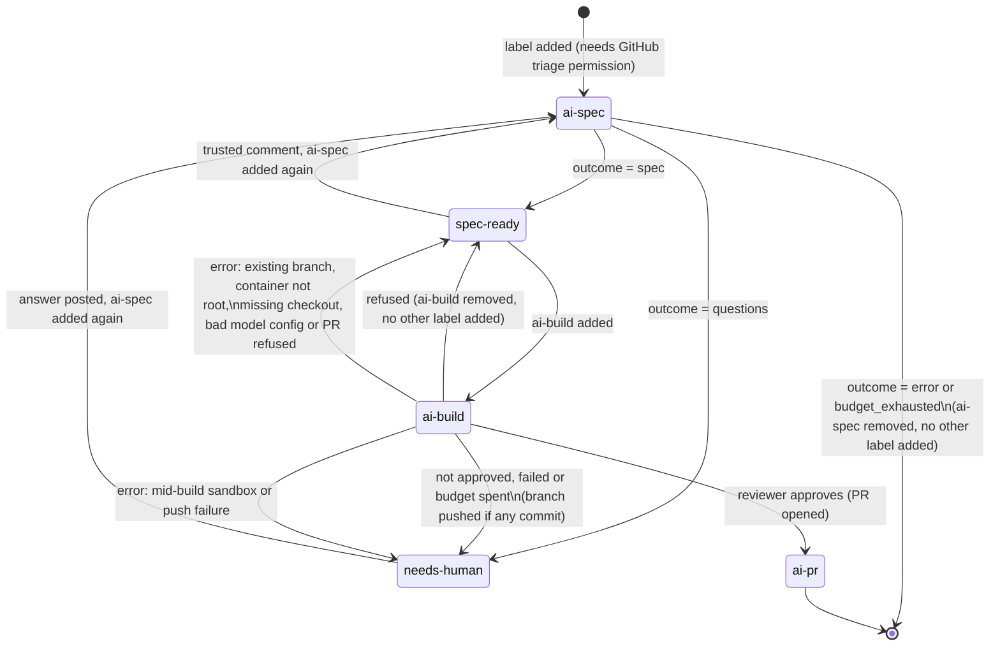

# Configuration reference

Everything the [README](../README.md) leaves out: the workflow's details, the providers, and
running Specster as your own bot. Every input and config key is in the README's
[Every setting](../README.md#every-setting).

## Labels and states



A trusted comment posted after the spec (an issue-author or collaborator reply, depending on
`trust.comments`) and `ai-spec` added again runs the spec phase in revision mode: the new spec
carries a "Changes from the previous spec" section instead of starting over. The same trusted
comment left in place and `ai-build` added instead is refused, since the spec does not cover it
yet (see "Build phase").

On a pull request, two other labels apply: `ai-evidence` (`labels.evidence`) and `ai-fix`
(`labels.fix`). Specster reads them from the `pull_request` event and ignores any other label
there. It refuses, with a short comment, a pull request from a fork (or from a deleted fork), a
closed one and a draft, and nothing else runs. Either way the label comes off at the end.

Adding a label needs the "triage" repository permission (or higher) on GitHub, so that permission
is the trigger control. `workflow_dispatch` with an `issue_number` input works the same way and is
useful for re-running a failed job without re-labeling.

## The workflow, line by line


- `actions/checkout` must run before Specster, or it has no repository to explore.
- The `concurrency` group is per issue or pull request number: two labelings of the same issue
  queue instead of racing. `cancel-in-progress: false` because a half-finished run must not be
  killed mid-comment. A pull request's `ai-evidence`, `ai-fix` and cleanup runs share its
  number's group, so they queue behind each other; against other runs, the evidence branch is
  protected by a leased push that retries once. The group is set on each job, not on the
  workflow: a job skipped by its `if` (another label, such as `bug`) never joins it, so it cannot
  take the place of a Specster run waiting in the queue.
- The `spec` job's `permissions` is the minimum: `contents: read` to explore the repo, `issues:
  write` to comment and change labels. The `build` job needs more: `contents: write` to push the
  branch, `pull-requests: write` to open the PR, `issues: write` to comment, change labels and
  (with `build.close_issue`, the default) let the PR close the issue on merge. With the default
  `GITHUB_TOKEN`, opening pull requests from an Action also needs "Allow GitHub Actions to create
  and approve pull requests" turned on in the repository's Settings > Actions > General; without
  it, the branch is still pushed but the pull request step is refused (see [Permissions](build.md#permissions)).
  The `evidence` and `fix` jobs need `contents: write` (to publish evidence, or push to the pull
  request's branch) and `pull-requests: write` (to comment, reply to review threads and change
  labels on the pull request).
  The `cleanup` job only needs `contents: write`, to remove the closed pull request's folder from
  the `specster-evidence` branch; it never comments on the pull request or the issue.
- Each job's `if` keeps other labels, other events and the other phase from ever starting the
  container: `spec` and `build` answer only `issues` events (and `workflow_dispatch`), so
  `ai-spec` on a pull request starts nothing. The label is also checked again inside Specster
  against `labels.spec` and `labels.build` (or `labels.evidence` and `labels.fix`) in the config. If
  you rename a label, change the matching `if:` too, or the job never starts. The `evidence` and
  `fix` jobs start only when their label is added to a pull request from a branch of this
  repository, never a fork; Specster checks that again against the pull request itself and refuses a
  fork. The `cleanup` job starts when any pull request from a branch of this repository is closed,
  merged or not, whoever closed it, bots included, except a close done with the default
  `GITHUB_TOKEN`, which triggers no workflow; Specster checks the repository again from the event
  and skips a fork.
- The `evidence`, `fix` and `cleanup` jobs check out the default branch, not the pull request:
  Specster's config, and in the dogfood workflow Specster itself, always come from there, so a
  pull request cannot raise its own trust or budget, and its code never runs with the job's
  token outside the sandbox. Specster checks this too: an `ai-evidence` or `ai-fix` run whose
  checkout is not the tip of the default branch is refused before it reads the pull request.
- The `build` job's `timeout-minutes: 120` gives parallel workers, correction rounds and the final
  test run room; the `spec` job only ever makes one model call, so 20 minutes is generous already.
  Keep `build.max_minutes` (default 100) below the build job's `timeout-minutes`: at that limit
  Specster stops the way a spent budget does (pushes what is done, comments, `needs-human`), while
  a job timeout kills the container with no comment and no cost recorded. Each test run is also
  shortened to the time the build has left, and no worker or reviewer starts another model turn
  once it has passed. The `fix` job builds the same way and gets the same 120 minutes, and so does
  the `evidence` job, which stops at the same `build.max_minutes` while it plans, sets up, serves
  and captures the base and the head.
- The step's `outcome` output is `questions`, `spec`, `refused`, `pr_opened`, `not_approved`,
  `build_failed`, `evidence_posted`, `error` or `budget_exhausted`, or `skipped` when the event
  was not for Specster (another label, a bot sender). A refused pull request (fork, closed,
  draft, no `build.preview` for `ai-evidence`, or a checkout that is not the default branch) ends
  `refused`. A cleanup ends `cleaned`, `skipped` when there was
  nothing to remove, or `error`.
- `github_token` can be the default `GITHUB_TOKEN` (comments come from "github-actions[bot]") or a
  GitHub App installation token (comments come from your own bot; see [Your own bot identity](#your-own-bot-identity)). A
  build refuses only when neither `identity.bot_login` nor the token's own login (asked over
  GraphQL) resolves; with the default `GITHUB_TOKEN` the login does resolve, so a build proceeds,
  but with a warning, since `github-actions[bot]` is shared by every workflow in the repository
  (see [Identity pinning](security.md)). Set `identity.bot_login` when using a GitHub App, so Specster
  recognizes its own past comments reliably.


## Action reference

Every input and output: [Action inputs and outputs](../README.md#every-setting) in the README.

Providers that take no key input:

| Provider | How it authenticates |
|---|---|
| `bedrock`, `vertex-anthropic`, `vertex-gemini` | OIDC: log in with the cloud's official action before Specster (see [Cloud OIDC logins](#cloud-oidc-logins)). |
| `openai-compatible` (DeepSeek, Ollama, vLLM, ...) | The environment variable named in `api_key_env`, passed with `env:` on the Specster step; none for local servers. |
| `azure-openai` without a key | Service-principal environment variables `AZURE_CLIENT_ID`, `AZURE_TENANT_ID`, `AZURE_CLIENT_SECRET`. |

## Configuration

Every key and its default: [All config keys](../README.md#every-setting) in the README.

## Telemetry

Metrics and traces are exported over OTLP when the standard `OTEL_EXPORTER_OTLP_*` environment variables are set on the Specster step. There is no `config.yml` key for it; see [Telemetry](telemetry.md).

## Providers

Every provider sits behind the same tool-calling interface. Each block below lists what
`models.planner` needs and which environment variable carries the credential; `models.worker` and
`models.reviewer` (used in the build phase) take the same fields and can pick a different provider
each.

**anthropic** - `model` (e.g. `claude-opus-5-5`). Reads `ANTHROPIC_API_KEY`, or the variable named
in `api_key_env`. `base_url` is optional, for a proxy in front of the Anthropic API.

**openai** - `model` (e.g. `gpt-5-mini`). Reads `OPENAI_API_KEY`, or `api_key_env`. `base_url` is
optional.

**openai-compatible** - any server that speaks the OpenAI API. `base_url` is required.
`api_key_env` is optional: without it, the key is `"not-needed"`, for local servers that accept
anything. Examples:

```yaml
# Gemini through its OpenAI-compatible endpoint
provider: openai-compatible
model: gemini-flash-latest
base_url: https://generativelanguage.googleapis.com/v1beta/openai/
api_key_env: GEMINI_API_KEY

# DeepSeek
provider: openai-compatible
model: deepseek-chat
base_url: https://api.deepseek.com
api_key_env: DEEPSEEK_API_KEY

# Ollama, no key
provider: openai-compatible
model: llama3.1
base_url: http://localhost:11434/v1
```

Since `github_token` and the four `*_api_key` inputs are the only secrets `action.yml` forwards,
an env var named in `api_key_env` that is not one of those (e.g. `DEEPSEEK_API_KEY`) needs its own
`env:` entry on the workflow step; Docker actions pass through any `env:` set there.

**azure-openai** - `base_url` (the resource endpoint) and `api_version` are required. With a key,
reads `AZURE_OPENAI_API_KEY` or `api_key_env`; without one, it authenticates with
`DefaultAzureCredential`. For now that means an API key or service-principal environment
variables (see "Azure" below): the `azure/login` az CLI session is not visible inside the
Specster container.

**bedrock** - `region` is required, `base_url` is rejected. `model` takes the `anthropic.` prefix
(e.g. `anthropic.claude-haiku-4-5`). No API key: it authenticates from the environment, normally
the AWS OIDC login below.

**vertex-anthropic** - `region` and `project` are required, `base_url` is rejected. No API key:
Application Default Credentials, normally the GCP OIDC login below.

**gemini** - `model` (e.g. `gemini-flash-latest`). Reads `GEMINI_API_KEY`, or `api_key_env`. The
Gemini free tier may use prompts to improve Google products. Do not point it at company code
unless you are on a paid tier with that turned off.

**vertex-gemini** - `region` and `project` are required, `base_url` is rejected. Application
Default Credentials, normally the GCP OIDC login below.

### Cloud OIDC logins

Add these before the Specster step, in the same job, with `id-token: write` added to
`permissions`. No long-lived cloud credentials are needed for AWS and GCP; Azure is the
exception, below.

AWS (for `bedrock`):

```yaml
permissions:
  contents: read
  issues: write
  id-token: write

steps:
  - uses: actions/checkout@v7
  - uses: aws-actions/configure-aws-credentials@v4
    with:
      role-to-assume: arn:aws:iam::123456789012:role/specster-bedrock
      aws-region: eu-west-1
  - uses: Endika/specster@v0
    with:
      github_token: ${{ secrets.GITHUB_TOKEN }}
```

GCP (for `vertex-anthropic` and `vertex-gemini`):

```yaml
  - uses: google-github-actions/auth@v3
    with:
      workload_identity_provider: projects/123456789/locations/global/workloadIdentityPools/specster/providers/github
      service_account: specster@my-project.iam.gserviceaccount.com
```

Azure (for `azure-openai` without a key): there is no OIDC login yet. `azure/login` stores an
az CLI session on the runner, and the Specster container cannot see it. Pass a service principal
as environment variables on the Specster step instead; `DefaultAzureCredential` reads them:

```yaml
  - uses: Endika/specster@v0
    env:
      AZURE_CLIENT_ID: ${{ secrets.AZURE_CLIENT_ID }}
      AZURE_TENANT_ID: ${{ secrets.AZURE_TENANT_ID }}
      AZURE_CLIENT_SECRET: ${{ secrets.AZURE_CLIENT_SECRET }}
    with:
      github_token: ${{ secrets.GITHUB_TOKEN }}
```

That is a long-lived secret; an `azure_openai_api_key` is the simpler equivalent.

## Your own bot identity

By default, comments come from `github-actions[bot]` using the workflow's `GITHUB_TOKEN`. To have
Specster comment as its own bot:

1. Create a GitHub App (organization or personal account settings, Developer settings > GitHub
   Apps). Turn the webhook off; nothing needs to reach it. Repository permissions: Issues
   (read and write), Metadata (read); for the build phase add Contents (read and write) and Pull
   requests (read and write) too - see [Permissions](build.md#permissions). Never grant the App the Workflows
   permission: without it GitHub refuses any push from Specster that changes a workflow file,
   whatever the model wrote. Use `assets/specster-avatar.png` as the App logo and
   `assets/specster-mascot.png` if you want it elsewhere. Build commits are authored with the
   token's own noreply address (`<id>+<login>@users.noreply.github.com`), so GitHub shows the
   App's logo on them; when the account cannot be looked up they fall back to
   `specster@users.noreply.github.com`, which has no avatar.
2. Generate a private key and install the App on the repository.
3. Store the App's Client ID (`Iv23...`, on the App's settings page; not the numeric App ID) as a
   repository or organization variable (e.g. `SPECSTER_CLIENT_ID`) and the private key as a secret
   (e.g. `SPECSTER_APP_KEY`).
4. Mint an installation token in the workflow and pass it as `github_token`:

```yaml
  - uses: actions/create-github-app-token@v3
    id: app
    with:
      client-id: ${{ vars.SPECSTER_CLIENT_ID }}
      private-key: ${{ secrets.SPECSTER_APP_KEY }}
  - uses: Endika/specster@v0
    with:
      github_token: ${{ steps.app.outputs.token }}
```

A private key is never shared between organizations: each org that wants its own bot identity
creates its own App and keeps its own key. `.github/workflows/specster.yml` in this repository is
a working example that makes the App step conditional (`if: vars.SPECSTER_CLIENT_ID != ''`), falling
back to `github.token`.
