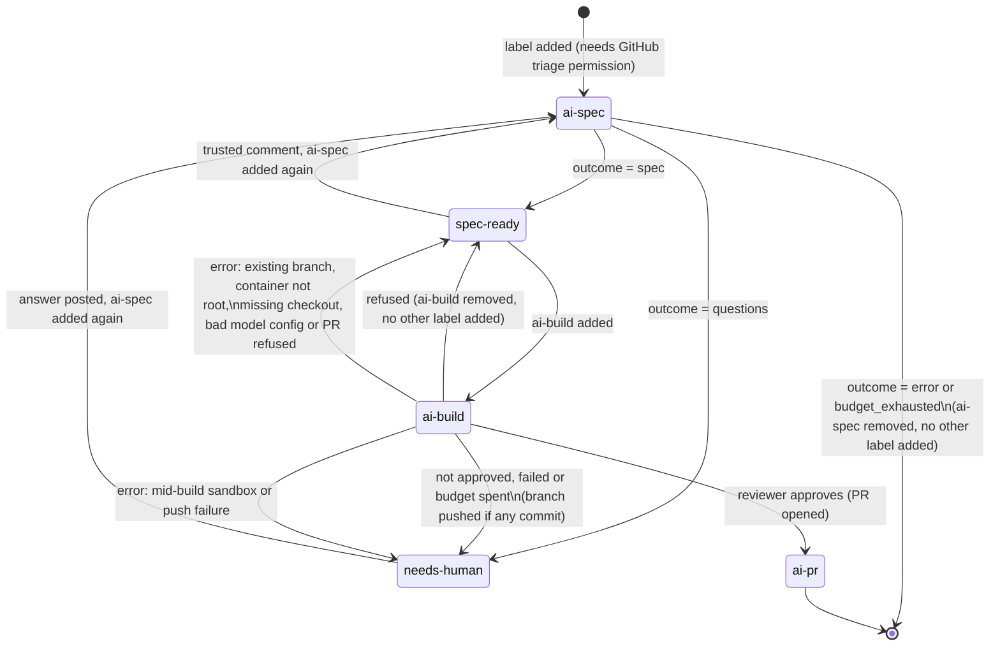

# Configuration reference

Everything the [README](../README.md) leaves out: the workflow's details, every input and
config key, the providers, and running Specster as your own bot.

## Labels and states



A trusted comment posted after the spec (an issue-author or collaborator reply, depending on
`trust.comments`) and `ai-spec` added again runs the spec phase in revision mode: the new spec
carries a "Changes from the previous spec" section instead of starting over. The same trusted
comment left in place and `ai-build` added instead is refused, since the spec does not cover it
yet (see "Build phase").

Adding a label needs the "triage" repository permission (or higher) on GitHub, so that permission
is the trigger control. `workflow_dispatch` with an `issue_number` input works the same way and is
useful for re-running a failed job without re-labeling.

## The workflow, line by line


- `actions/checkout` must run before Specster, or it has no repository to explore.
- The `concurrency` group is per issue: two labelings of the same issue queue instead of racing.
  `cancel-in-progress: false` because a half-finished run must not be killed mid-comment.
  A closed pull request's cleanup uses the group of the pull request's number, so two closes of
  the same pull request queue; against other runs, the evidence branch is protected by a leased
  push that retries once.
- The `spec` job's `permissions` is the minimum: `contents: read` to explore the repo, `issues:
  write` to comment and change labels. The `build` job needs more: `contents: write` to push the
  branch, `pull-requests: write` to open the PR, `issues: write` to comment, change labels and
  (with `build.close_issue`, the default) let the PR close the issue on merge. With the default
  `GITHUB_TOKEN`, opening pull requests from an Action also needs "Allow GitHub Actions to create
  and approve pull requests" turned on in the repository's Settings > Actions > General; without
  it, the branch is still pushed but the pull request step is refused (see [Permissions](build.md#permissions)).
  The `cleanup` job only needs `contents: write`, to remove the closed pull request's folder from
  the `specster-evidence` branch; it never comments on the pull request or the issue.
- Each job's `if` keeps other labels, other issue events and the other phase from ever starting
  the container; the label is also checked again inside Specster against `labels.spec` and
  `labels.build` in the config. If you rename either label, change the matching `if:` too, or the
  job never starts. The `cleanup` job starts only when a pull request from a `specster/issue-*`
  branch of this repository (never a fork) is closed, merged or not, whoever closed it, bots
  included, except a close done with the default `GITHUB_TOKEN`, which triggers no workflow;
  Specster checks the branch again and skips any other. It checks out the default branch, not the
  pull request, so a closed and unmerged pull request's code never runs with the job's token.
- The `build` job's `timeout-minutes: 120` gives parallel workers, correction rounds and the final
  test run room; the `spec` job only ever makes one model call, so 20 minutes is generous already.
  Keep `build.max_minutes` (default 100) below the build job's `timeout-minutes`: at that limit
  Specster stops the way a spent budget does (pushes what is done, comments, `needs-human`), while
  a job timeout kills the container with no comment and no cost recorded. Each test run is also
  shortened to the time the build has left, and no worker or reviewer starts another model turn
  once it has passed.
- The step's `outcome` output is `questions`, `spec`, `refused`, `pr_opened`, `not_approved`,
  `build_failed`, `error` or `budget_exhausted`, or `skipped` when the event was not for Specster
  (another label, a bot sender). A cleanup ends `cleaned`, `skipped` when there was nothing to
  remove, or `error`.
- `github_token` can be the default `GITHUB_TOKEN` (comments come from "github-actions[bot]") or a
  GitHub App installation token (comments come from your own bot; see [Your own bot identity](#your-own-bot-identity)). A
  build refuses only when neither `identity.bot_login` nor the token's own login (asked over
  GraphQL) resolves; with the default `GITHUB_TOKEN` the login does resolve, so a build proceeds,
  but with a warning, since `github-actions[bot]` is shared by every workflow in the repository
  (see [Identity pinning](security.md)). Set `identity.bot_login` when using a GitHub App, so Specster
  recognizes its own past comments reliably.


## Action reference

Everything `Endika/specster@v0` accepts. Pass the key(s) of whichever provider(s) `models.planner`,
`models.worker` and `models.reviewer` are set to (they can differ); unused key inputs stay empty.

| Input | Required | Default | What it is |
|---|---|---|---|
| `github_token` | yes | | Reads the issue and comments; a build also pushes and opens a pull request. `GITHUB_TOKEN` comments as github-actions[bot]; a GitHub App token comments as your bot. |
| `config_path` | no | `.github/specster/config.yml` | Path of the config file in the repository. |
| `issue_number` | no | | Issue to process when the workflow runs from `workflow_dispatch`. |
| `phase` | no | `spec` | Phase to run when triggered by `workflow_dispatch`: `spec` or `build`. Ignored for the `issues: labeled` event, where the label itself decides the phase. |
| `anthropic_api_key` | no | | Key for provider `anthropic`. |
| `openai_api_key` | no | | Key for provider `openai`. |
| `gemini_api_key` | no | | Key for provider `gemini` (and for `openai-compatible` pointed at Gemini with `api_key_env: GEMINI_API_KEY`). |
| `azure_openai_api_key` | no | | Key for provider `azure-openai`. |
| `skills_auth_token` | no | | Token for skills stored in private GitHub repositories; only sent to GitHub hosts. |

| Output | Values |
|---|---|
| `outcome` | `questions`, `spec`, `refused`, `pr_opened`, `not_approved`, `build_failed`, `error`, `budget_exhausted`, `cleaned` (a closed pull request's evidence removed), or `skipped` when the event was not for Specster |

Providers that take no key input:

| Provider | How it authenticates |
|---|---|
| `bedrock`, `vertex-anthropic`, `vertex-gemini` | OIDC: log in with the cloud's official action before Specster (see [Cloud OIDC logins](#cloud-oidc-logins)). |
| `openai-compatible` (DeepSeek, Ollama, vLLM, ...) | The environment variable named in `api_key_env`, passed with `env:` on the Specster step; none for local servers. |
| `azure-openai` without a key | Service-principal environment variables `AZURE_CLIENT_ID`, `AZURE_TENANT_ID`, `AZURE_CLIENT_SECRET`. |

Every model, label, trust, skill, persona and budget option lives in the config file:
see [Configuration](#configuration) for the full list with defaults.

## Configuration

Optional file at `.github/specster/config.yml` (path set by the `config_path` input). A missing
file or a missing key uses the default shown below. An unknown key or an invalid value fails the
run with a message naming the key. Action inputs (`github_token`, `config_path`, the `*_api_key`
inputs, `skills_auth_token`) always take precedence over this file.

```yaml
models:
  planner:                     # writes the spec and the task plan
    provider: anthropic        # anthropic | openai | openai-compatible | azure-openai | bedrock | vertex-anthropic | gemini | vertex-gemini
    model: claude-opus-5-5
    max_tokens: 16000
    effort: null                # low | medium | high | xhigh | max, provider-specific; null leaves the SDK default
    base_url: null               # required for openai-compatible and azure-openai; rejected for bedrock, vertex-anthropic, gemini, vertex-gemini
    region: null                 # required for bedrock, vertex-anthropic, vertex-gemini
    project: null                # required for vertex-anthropic, vertex-gemini
    api_version: null            # required for azure-openai
    api_key_env: null            # overrides which environment variable carries the API key
    token_param: null            # max_tokens | max_completion_tokens; provider default otherwise
    max_retries: 4
  worker:                       # writes one task's code in the build phase; same fields as planner
    provider: anthropic
    model: claude-opus-5-5
  reviewer:                     # reviews the build's diff before the pull request; same fields as planner
    provider: anthropic
    model: claude-opus-5-5
    effort: medium
  escalation: null              # a stronger worker for one more try at a failed or twice-blocked task;
                                # e.g. {provider: anthropic, model: claude-opus-5-5}; see docs/build.md

labels:
  spec: ai-spec                 # trigger label for the spec phase
  needs_human: needs-human      # applied when Specster asks questions, or a build needs a human
  ready: spec-ready             # applied when Specster publishes a spec
  build: ai-build                # trigger label for the build phase
  built: ai-pr                    # applied when a build opens a pull request

trust:
  comments: collaborators       # all | collaborators | owner: who counts, by author_association
  issue_author: true             # the issue author's comments count too, whatever their association
  snapshot_at_label: true        # only count comments that existed before the triggering label event

identity:
  bot_login: null                # the login Specster comments as, e.g. specster-endika[bot];
                                  # null asks the token, which an App installation token may not
                                  # answer. A build refuses outright when neither gives an answer.

skills:
  autodiscover: true             # pick up AGENTS.md, CLAUDE.md, .github/copilot-instructions.md,
                                  # .cursorrules, .cursor/rules/*.mdc, CONTRIBUTING.md,
                                  # .github/specster/skills/*.md
  sources: []                    # extra skills, e.g.:
                                  #   - path: docs/spec-style.md
                                  #   - url: https://raw.githubusercontent.com/org/repo/main/skill.md
                                  #     sha256: "<64 hex chars>"
                                  #     phases: [spec]        # spec | build | review; default: all three
  load: always                    # always: every skill of the phase is loaded (up to max_tokens)
                                  # model_decides: the model sees names only and may read none
  max_tokens: 20000                # token budget for skills inlined when load: always

repo_map:
  max_tokens: 8000
  exclude: ["node_modules/", "dist/", "build/", "vendor/", "*.lock", "*.min.js"]

persona:
  name: Specster
  avatar_url: https://raw.githubusercontent.com/Endika/specster/main/assets/specster-avatar.png
  header: true
  humor: light                    # off | light | spooky; only ever shows up in closing_line
  closing_line: generated          # off | generated | fixed
  closing_text: ""                  # required when closing_line: fixed
  language: en                      # language of questions, spec and build text
  style: concise                    # concise | detailed: how much text the comments carry
  max_questions: 3                  # 1-5 questions per round

budget:
  max_usd_per_issue: 8.0             # null removes the cap; sums every run on the issue, spec and build alike
  max_usd_per_build: 5.0              # null removes the cap; this one build's own spend
  max_turns: 30                       # hard stop on the agent loop (any role), independent of cost

build:
  max_parallel: 2                     # workers running at once, 1-8; also the sandbox slots created
  max_turns_per_task: 40              # hard stop on one worker's agent loop
  max_review_rounds: 2                 # correction rounds after a blocked review before giving up
  setup_command: null                  # argv list run once before test_command, as the sandbox uid; null skips it
  test_command: null                   # argv list run as the sandbox uid; null means no tests ever run
  test_env: {}                         # extra environment variables for setup_command and test_command (not HOME or TMPDIR)
  tools: {}                            # toolchains mise installs, e.g. {node: "22", java: "21"}; see docs/build.md
  test_timeout_s: 600                  # wall-clock limit per invocation of either command
  test_output_max_kb: 20               # tail kept of each command's combined stdout+stderr
  test_output_max_file_mb: 1024        # RLIMIT_FSIZE per process; a file over this kills the command
  max_minutes: 100                     # wall-clock limit on the whole build; keep it below the job's timeout-minutes
  close_issue: true                    # the pull request body carries "Closes #<issue>"
  allow_comments_after_spec: false     # true lets a build run despite trusted comments posted after the spec
  allow_failing_base: false            # true builds even when test_command already fails before any task
  allow_workflow_changes: false        # true lets a task change .github/workflows/** and .github/actions/**
  allow_config_changes: false          # true lets a task change .github/specster/** and the config_path file
  # Before/after evidence for the pull request (off unless set): Specster starts the app at
  # the base commit and at the branch head and sends both the requests the spec lists.
  preview:
    serve_command: [python, -m, app]           # runs in the sandbox; must keep running
    ready_url: http://127.0.0.1:8000/health    # polled until it answers; loopback only
    seed_command: [python, seed.py]            # optional, before serve_command; no real data
    ready_timeout_s: 60                        # at most 300

pricing: {}                            # override or add prices, USD per million tokens:
                                        #   claude-haiku-4-5: {input: 1.0, output: 5.0, cache_read: 0.1, cache_write: 1.25}
```

`skills.sources[].phases` defaults to `all` (spec, build and review); with `load: always` every
skill scoped to the phase that is running is inlined into the prompt, up to `skills.max_tokens`.
`budget.max_usd_per_build` and `budget.max_usd_per_issue` (5.0 and 8.0 by default) are safety
caps chosen before any build's real cost was measured, not expected spend - see [what it costs](../README.md#what-it-costs).

## Providers

Every provider sits behind the same tool-calling interface. Each block below lists what
`models.planner` needs and which environment variable carries the credential; `models.worker` and
`models.reviewer` (used in the build phase) take the same fields and can pick a different provider
each.

**anthropic** - `model` (e.g. `claude-opus-5-5`). Reads `ANTHROPIC_API_KEY`, or the variable named
in `api_key_env`. `base_url` is optional, for a proxy in front of the Anthropic API.

**openai** - `model` (e.g. `gpt-5-mini`). Reads `OPENAI_API_KEY`, or `api_key_env`. `base_url` is
optional.

**openai-compatible** - any server that speaks the OpenAI API. `base_url` is required.
`api_key_env` is optional: without it, the key is `"not-needed"`, for local servers that accept
anything. Examples:

```yaml
# Gemini through its OpenAI-compatible endpoint
provider: openai-compatible
model: gemini-flash-latest
base_url: https://generativelanguage.googleapis.com/v1beta/openai/
api_key_env: GEMINI_API_KEY

# DeepSeek
provider: openai-compatible
model: deepseek-chat
base_url: https://api.deepseek.com
api_key_env: DEEPSEEK_API_KEY

# Ollama, no key
provider: openai-compatible
model: llama3.1
base_url: http://localhost:11434/v1
```

Since `github_token` and the four `*_api_key` inputs are the only secrets `action.yml` forwards,
an env var named in `api_key_env` that is not one of those (e.g. `DEEPSEEK_API_KEY`) needs its own
`env:` entry on the workflow step; Docker actions pass through any `env:` set there.

**azure-openai** - `base_url` (the resource endpoint) and `api_version` are required. With a key,
reads `AZURE_OPENAI_API_KEY` or `api_key_env`; without one, it authenticates with
`DefaultAzureCredential`. For now that means an API key or service-principal environment
variables (see "Azure" below): the `azure/login` az CLI session is not visible inside the
Specster container.

**bedrock** - `region` is required, `base_url` is rejected. `model` takes the `anthropic.` prefix
(e.g. `anthropic.claude-haiku-4-5`). No API key: it authenticates from the environment, normally
the AWS OIDC login below.

**vertex-anthropic** - `region` and `project` are required, `base_url` is rejected. No API key:
Application Default Credentials, normally the GCP OIDC login below.

**gemini** - `model` (e.g. `gemini-flash-latest`). Reads `GEMINI_API_KEY`, or `api_key_env`. The
Gemini free tier may use prompts to improve Google products. Do not point it at company code
unless you are on a paid tier with that turned off.

**vertex-gemini** - `region` and `project` are required, `base_url` is rejected. Application
Default Credentials, normally the GCP OIDC login below.

### Cloud OIDC logins

Add these before the Specster step, in the same job, with `id-token: write` added to
`permissions`. No long-lived cloud credentials are needed for AWS and GCP; Azure is the
exception, below.

AWS (for `bedrock`):

```yaml
permissions:
  contents: read
  issues: write
  id-token: write

steps:
  - uses: actions/checkout@v7
  - uses: aws-actions/configure-aws-credentials@v4
    with:
      role-to-assume: arn:aws:iam::123456789012:role/specster-bedrock
      aws-region: eu-west-1
  - uses: Endika/specster@v0
    with:
      github_token: ${{ secrets.GITHUB_TOKEN }}
```

GCP (for `vertex-anthropic` and `vertex-gemini`):

```yaml
  - uses: google-github-actions/auth@v3
    with:
      workload_identity_provider: projects/123456789/locations/global/workloadIdentityPools/specster/providers/github
      service_account: specster@my-project.iam.gserviceaccount.com
```

Azure (for `azure-openai` without a key): there is no OIDC login yet. `azure/login` stores an
az CLI session on the runner, and the Specster container cannot see it. Pass a service principal
as environment variables on the Specster step instead; `DefaultAzureCredential` reads them:

```yaml
  - uses: Endika/specster@v0
    env:
      AZURE_CLIENT_ID: ${{ secrets.AZURE_CLIENT_ID }}
      AZURE_TENANT_ID: ${{ secrets.AZURE_TENANT_ID }}
      AZURE_CLIENT_SECRET: ${{ secrets.AZURE_CLIENT_SECRET }}
    with:
      github_token: ${{ secrets.GITHUB_TOKEN }}
```

That is a long-lived secret; an `azure_openai_api_key` is the simpler equivalent.

## Your own bot identity

By default, comments come from `github-actions[bot]` using the workflow's `GITHUB_TOKEN`. To have
Specster comment as its own bot:

1. Create a GitHub App (organization or personal account settings, Developer settings > GitHub
   Apps). Turn the webhook off; nothing needs to reach it. Repository permissions: Issues
   (read and write), Metadata (read); for the build phase add Contents (read and write) and Pull
   requests (read and write) too - see [Permissions](build.md#permissions). Never grant the App the Workflows
   permission: without it GitHub refuses any push from Specster that changes a workflow file,
   whatever the model wrote. Use `assets/specster-avatar.png` as the App logo and
   `assets/specster-mascot.png` if you want it elsewhere. Build commits are authored with the
   token's own noreply address (`<id>+<login>@users.noreply.github.com`), so GitHub shows the
   App's logo on them; when the account cannot be looked up they fall back to
   `specster@users.noreply.github.com`, which has no avatar.
2. Generate a private key and install the App on the repository.
3. Store the App's Client ID (`Iv23...`, on the App's settings page; not the numeric App ID) as a
   repository or organization variable (e.g. `SPECSTER_CLIENT_ID`) and the private key as a secret
   (e.g. `SPECSTER_APP_KEY`).
4. Mint an installation token in the workflow and pass it as `github_token`:

```yaml
  - uses: actions/create-github-app-token@v3
    id: app
    with:
      client-id: ${{ vars.SPECSTER_CLIENT_ID }}
      private-key: ${{ secrets.SPECSTER_APP_KEY }}
  - uses: Endika/specster@v0
    with:
      github_token: ${{ steps.app.outputs.token }}
```

A private key is never shared between organizations: each org that wants its own bot identity
creates its own App and keeps its own key. `.github/workflows/specster.yml` in this repository is
a working example that makes the App step conditional (`if: vars.SPECSTER_CLIENT_ID != ''`), falling
back to `github.token`.
